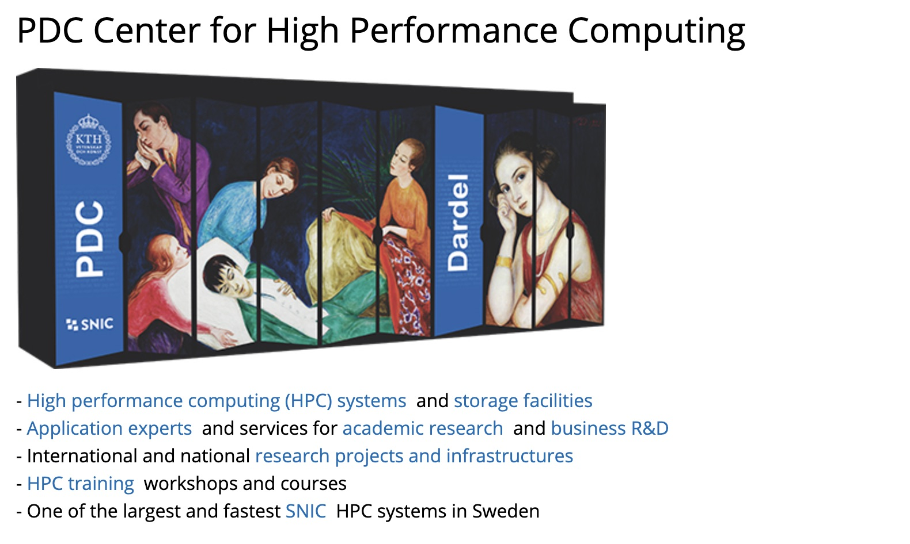

# <!--fit--> Introduction to PDC

2022-03-23

PDC staff

<style scoped>a { color: #eee; }</style>

<!-- This is presenter note. You can write down notes through HTML comment. -->

---



---

# History of PDC

| Year | rank | procs. | peak TFlops | vendor | name | remark |
| --- | --- | --- | --- | --- | --- | --- |
| 2017 | 69  | 67456 | 2438.1 | Cray | Beskow | XC40 16-core 2.3GHz |
| 2014 | 32  | 53632 | 1973.7 | Cray | Beskow | |
| 2011 | 31  | 36384 | 305.63 | Cray | Lindgren | XE6 12-core 2.1GHz  |
| 2010 | 76  | 11016 | 92.534 | Cray | Lindgren | |
| 2010 | 89  | 9800  | 86.024 | Dell | Ekman | PowerEdge SC1435 Dual core Opteron 2.2GHz |

---

# History of PDC

| Year | rank | procs. | peak TFlops | vendor | name | remark |
| --- | --- | --- | --- | --- | --- | --- |
| 2005 | 65  | 886   | 5.6704 | Dell | Lenngren | PowerEdge 1850 3.2GHz |
| 2003 | 196 | 180   | 0.6480 | HP | Lucidor | Cluster Platform 6000 rx2600 Itanium2 900MHz |
| 1998 | 60  | 146   | 0.0934 | IBM | Strindberg | SP P2SC 160MHz  |
| 1996 | 64  | 96    | 0.0172 | IBM | Strindberg | |
| 1994 | 341 | 256   | 0.0025 | Thinking Machines | Bellman | CM-200/8k  |

---

# PDC is a SNIC center


* SNIC (Swedish National Infrastructure for Computing)

* SNIC is a national research infrastructure that provides a balanced and cost-efficient set of resources and user support for large scale computation and data storage to meet the needs of researchers from all scientific disciplines and from all over Sweden (universities, university colleges, research institutes, etc).

* SNIC is funded by the Swedish Research Council (VR-RFI) and the 10 participating universities: Chalmers, GU, KI, KTH, LiU, LU, SLU, SU, UmU, and UU.

---

# Collaboration with Industry


PDC's largest industrial partner is Scania. The figure shows a volume rendering of the instantaneous velocity magnitude on the leeward side of a Scania R20 Highline truck at crosswind conditions. (Source: Scania)

---

# Collaboration with industry

* Business partners

    - https://www.pdc.kth.se/research/business-research/pdc-partners

* White papers from research collaborations between PDC and European companies

    - https://www.pdc.kth.se/research/business-research/white-papers-1.737818

* A small part of Dardel nodes will be dedicated to industry/business research.

* If you are interested in purchasing HPC compute time, contact PDC Support.

---

# Broad range of training

* Summer School

    - Introduction to HPC held every year

* SNIC Zoom-in (advertised in SNIC training newsletter)

* Workshops (see [PDC events](https://www.pdc.kth.se/about/events))

* PDC User Days

    - PDC Pub and Open House

* University Courses that use PDC systems

    - KTH courses: DD2356, DD2365, SF2568, FDD3258, ...
    - SU courses: BL4018, BL8060

---

# Support and System Staff

* First-Line Support

  - Provide specific assistance to PDC users related to accounts, login, allocations etc.

* System Staff

  - System managers/administrators ensure that computing and storage resources run smoothly and securely.

* [Application Experts](https://www.pdc.kth.se/hpc-services/application-expert-help)

  - Hold PhD degrees in various fields and specialize in HPC. Assist researchers in optimizing, scaling and enhancing scientific codes for current and next generation supercomputers.

---

<!-- paginate: true -->


# Introduction to Dardel supercomputer

2022-03-23

[About Dardel](https://www.pdc.kth.se/hpc-services/computing-systems/about-dardel-1.1053338)

---

# Dardel is an HPE Cray EX system

* Phase 1: CPU partition

    - 2.279 petaFlops (Top500 Nov 2021)
    - 554 CPU nodes
    - Dual AMD EPYC(TM) 64-core processors

* Phase 2: GPU partition

    - 56 GPU nodes
    - AMD EPYC(TM) processor with 64 cores
    - four AMD Instinct(TM) MI250X GPUs

---


---

# Supercomputer anatomy

* Dardel consists of several cabinets (also known as racks)

* Each cabinet is filled with many blades

* A single blade hosts two nodes

* A node has two AMD EPYC 7742 CPUs, each with 64 cores clocking at 2.25GHz

---

# Compute nodes

| Number of nodes | RAM per node | Name |
| --- | --- | --- |
| 488 | 256 GB | Thin nodes |
| 20 | 512 GB | Large nodes |
| 8 | 1 TB | Huge nodes |
| 2 | 2 TB| Giant nodes |
| 36 | 256 GB | Business nodes |

Total: **554** Nodes (128 cores per node)

---

# Non-uniform memory access (NUMA)

* Memory access time depends on the relative location of memory

* Accessing local memory is faster compared to non-local memory

* On Dardel compute node: 8 NUMA domains (16 cores in each NUMA domain)
  ```
  salloc -N 1 ...
  srun -n 1 numactl --hardware
  ```

---

# Non-uniform memory access (NUMA)

```
available: 8 nodes (0-7)
node 0 cpus: 0 1 2 3 4 5 6 7 8 9 10 11 12 13 14 15 128 129 130 ... 141 142 143
node 0 size: 31620 MB
node 0 free: 30673 MB
...
node 7 cpus: 112 113 114 115 116 ... 123 124 125 126 127 240 241 242 ... 253 254 255
node 7 size: 32246 MB
node 7 free: 31375 MB
```

---

# Non-uniform memory access (NUMA)

```
node distances:
node   0   1   2   3   4   5   6   7
  0:  10  12  12  12  32  32  32  32
  1:  12  10  12  12  32  32  32  32
  2:  12  12  10  12  32  32  32  32
  3:  12  12  12  10  32  32  32  32
  4:  32  32  32  32  10  12  12  12
  5:  32  32  32  32  12  10  12  12
  6:  32  32  32  32  12  12  10  12
  7:  32  32  32  32  12  12  12  10
```

---

<!-- paginate: true -->


# Account, Login and File System

2022-03-23

[PDC support documentation](https://www.pdc.kth.se/support)

---

# Getting a PDC account

* From [SUPR](https://supr.snic.se/)

    - Get a SUPR account
    - Join a project with time allocation on Dardel
        - PI: create proposal for small/medium/large allocation
        - collaborators: added to project by PI
    - Request a PDC account from SUPR

* From [PDC webpage](https://www.pdc.kth.se/support/documents/getting_access/get_access.html#course-account)

    - Attend a course or training event
    - Fill in the form and provide a copy of passport or national ID

---

# Time allocation (project)

* Unit: core-hours per month

* SNIC projects are managed in SUPR.

* Course/Workshop allocations are managed locally at PDC.

* Use ``projinfo`` to list the projects that you have access to.

---

# Login


* Method 1: Use Kerberos ticket
    - [Windows: PuTTY + NIM](https://www.pdc.kth.se/support/documents/login/windows_login.html)
    - [Linux: openssh-client](https://www.pdc.kth.se/support/documents/login/linux_login.html)
    - [macOS: homebrew-openssh-gssapi](https://www.pdc.kth.se/support/documents/login/mac_login.html)

* Method 2: Use SSH keys
    - Upload your public key in [PDC login portal](https://loginportal.pdc.kth.se/)

---

# Login with Kerberos ticket

* Edit ``/etc/krb5.conf`` on Linux/macOS

* ``kinit -f <your-username>@NADA.KTH.SE``
    - use NIM on Windows
    - use ``/usr/bin/kinit -f ...`` on macOS

* ``ssh -o GSSAPIDelegateCredentials=yes -o GSSAPIKeyExchange=yes -o GSSAPIAuthentication=yes <your-username>@dardel.pdc.kth.se``
    - use PuTTY on Windows
    - you can put SSH options in ``~/.ssh/config`` on Linux/macOS

---

# Login with SSH keys

* Generate SSH key pair
  ```
  ssh-keygen -t ed25519 -f ~/.ssh/id-ed25519-pdc
  ```
  - Create ``~/.ssh`` folder if it doesn't exist
    ```
    mkdir ~/.ssh && chmod 700 ~/.ssh
    ```

* Upload SSH public key in [PDC login portal](https://loginportal.pdc.kth.se/)

* Login using SSH key
  ```
  ssh -i ~/.ssh/id-ed25519-pdc <your-username>@dardel.pdc.kth.se
  ```

---

# Exercise: Log in to Dardel

---

# File System

Lustre File System (Klemming, total size 12 PB (12,000 TB))

* Open-source massively parallel distributed file system
* Optimized for handling data from many clients
* Home directory (25 GB quota, with backup)
  ```
  /cfs/klemming/home/[u]/[username]
  ```
* Project directory
  ```
  /cfs/klemming/projects/snic/[projectname]
  ```
* Scratch directory
  ```
  /cfs/klemming/scratch/[u]/[username]
  ```

---

# Exercise: Home and project directories

* Home directory
  ```
  cd && pwd
  ```
  or
  ```
  echo $HOME
  ```

* Project directory
  ```
  projinfo
  ```

---

# Find out your groups

In addition to ``projinfo``, your groups also indicate the projects that you have access to.

```
groups
```
* groups starting with ``cac-`` are associated with compute projects
* groups starting with ``pg_`` are associated with storage projects

---

# Find out your storage quota

* Home directory
  ```
  lfs quota -hg $USER /cfs/klemming/
  ```
  Note: This takes into account files under ``/cfs/klemming/scratch/``

* Project directory
  ```
  lfs quota -hg pg_xxxxxx /cfs/klemming/
  ```
  Replace ``pg_xxxxxx`` by the actual group name.

---

# Use of file system

* Good practice
  - Minimize the number of I/O operations
  - Avoid creating too many files
  - Avoid creating directories with a large numbers of files
* Bad practice
  - Small reads
  - Opening many files
  - Seeking within a le to read a small piece of data

---

# Access Control Lists

### To view the access for a folder:
```
getfacl -a /cfs/klemming/home/u/user/test
```
### The output looks like this:
```
# file: /cfs/klemming/home/u/user/test
# owner: me
# group: users
user::rwx
group::r-x
other::---
```

---

# Access Control Lists

### To grant the access to another user ("-R" for recursive):
```
setfacl -m u:<uid>:r-x -R /cfs/klemming/home/u/user/test
```
### To remove the access for another user ("-R" for recursive):
```
setfacl -x u:<uid> -R /cfs/klemming/home/u/user/test
```

---

# Using Bash shell

### [name of lecturer]

---

# Running jobs with efficient utilization of hardware

### [name of lecturer]

---

# Using MATLAB


MATLAB is a proprietary multi-paradigm programming language and numeric computing environment developed by MathWorks.

MATLAB allows matrix manipulations, plotting of functions and data, implementation of algorithms, creation of user interfaces, and interfacing with programs written in other languages.

---

# MATLAB at PDC

## Licensing

In order to use MATLAB you need to have a MATLAB license.

KTH has a site-wide license for MATLAB which includes all MATLAB toolboxes.

To access the installation of MATLAB on Dardel, please contact PDC support and request access.

## Interactive and batch use of MATLAB

MATLAB can be run on Dardel both in interactive sessions, with or without a graphical user interface, or in batch jobs.

---

# Running interactively

Matlab can be run interactively on an allocated node. To book a single node for one hour

```
salloc -N 1 -t 1:00:00 -A pdc.staff -p main
```

Wait for a node to reserved

```
salloc: Granted job allocation 591571
salloc: Waiting for resource configuration
salloc: Nodes nid001015 are ready for job
```

Log in to the node

```
ssh -X nid00105
```


---
and start MATLAB with graphical user interface

```
ml PDC/21.11
ml matlab/r2021b
matlab
```

Altenatively to a full node, request cores on the shared partition

```
salloc -n 24 -t 1:00:00 -A pdc.staff -p shared
```

---

# Parallel computation with Matlab

MATLAB implements a large set of solutions for parallel computing.

* Vectorization
* Automated pararalle computing support
* Parallel execution of loops with ``parfor``
* Running multiple serial batch jobs

---

# Parallel execution with ``parfor``

Calculation of the spectral radius of a matrix

Consider first serial code:

```
tic
n = 500;
A = 1000;
a = zeros(n);
for i = 1:n
    a(i) = max(abs(eig(rand(A))));
end
toc
```

Execution time on one core: 297 s

Can this be parallelized? How large is the overhead?

---

A ``parfor`` loop can be used to execute loop iterations in parallel on workers in a parallel pool.

Replace `for` statements in earlier example with ``parfor``

```
tic
ticBytes(gcp);
n = 500;
A = 1000;
a = zeros(n);
parfor i = 1:n
    a(i) = max(abs(eig(rand(A))));
end
tocBytes(gcp)
toc
```

Execution time on 24 cores: 30 s

Speedup as compared to execution time on 1 core: 9.9

---
# Parallel execution of MATLAB in batch jobs`

Also for batch job use of MATLAB, consider to use the shared partition of Dardel. Example job script


```
#!/bin/bash -l
#SBATCH -A snicYYYY-X-XX
#SBATCH -J myjob
#SBATCH -p shared
#SBATCH -n 16
#SBATCH -t 10:00:00

# Load the Matlab module
ml add PDC/21.11
ml matlab/r2021b

# Run matlab taking your_matlab_program.m as input
matlab -batch your_matlab_program.m > your_matlab_program.out
```

---

# Running multiple serial batch jobs

```
#!/bin/bash -l
#SBATCH -A snicYYYY-X-XX
#SBATCH -J myjob
#SBATCH -p shared
#SBATCH -n 24
#SBATCH -t 10:00:00

# Load the Matlab module
ml add PDC/21.11
ml matlab/r2021b

# Run matlab for 24 individual programs serial_program_1.m,
# serial_program_2.m ... and print output in files logfile_1, logfile_2, ...
# The input files must be in the directory where you submit this script.
# This is also where the output will be created.

for i in {1..24} ; do
    matlab -nosplash -nodesktop -nodisplay < serial_program_${i}.m > logfile_$i &
done
# this wait command must be present since otherwise the job will terminate immediately
wait
```

---

# Exercise 1

---

# Exercise 2

---


# Using Python virtual environment

### [name of lecturer]

---


# How to use EasyBuild on Dardel

### 2022-03-24

### https://docs.easybuild.io/en/latest/

---

# Methods of installing software at PDC

* EasyBuild https://www.pdc.kth.se/support/documents/software_development/easybuild.html
* Spack https://www.pdc.kth.se/support/documents/software_development/spack.html
* Manually https://www.pdc.kth.se/support/documents/software_development/development_dardel.html

---

# What is EasyBuild

* Started in 2008 by HPC team at Ghent university, Belgium
* Software build and installation framework
* Tailored towards High Performance Computing (HPC) systems
* Installs HPC software using procedures described in recipes

---

# What modules are available

### For local installations

```
ml PDC
ml EasyBuild-user
```

* INSTALLPATH: *$HOME/.local/easybuild*
* SOURCEPATH: *$HOME/.local/easybuild/sources*
* adds to MODULEPATH: *$HOME/.local/easybuild/modules/all*
* Temporary folder: /tmp

---

# How is EasyBuild configured

```
$ eb --show-config
# (C: command line argument, D: default value, E: environment variable, F: configuration file)
#
buildpath          (E) = /tmp/eb-build
...
sourcepath         (D) = /cfs/klemming/home/h/hzazzi/.local/easybuild/sources
```

:red_circle: Current EasyBuild configuration can be changed if needed

```
$ eb --show-config --<CONFIG-NAME>=<VALUE>
```

---

# Exercise 1

* Load the EasyBuild-user module
* Check how it is configured
* Change some of the configuration parameters

---

# What are easyconfigs files

* Plain text file to define installation parameters

* serves as a build specification for software installation

* Is typically named:
  ```
  <name>-<version>[-<toolchain>][<versionsuffix>].eb
  ```
* Example
  ```
  GROMACS-2021.3-cpeGNU-21.11.eb
  ```

---

# What is a toolchain

* Defines what compiler toolchains to install the software with
* On Cray we have compiler wrappers, so all software is installed within the Cray Programming Environment (CPE)

  ```
  cpeGNU version 21.11
  cpeCray version 21.11
  cpeAMD version 21.11
  ```
* Softwares not in need of parallelization can use the **SYSTEM** toolchain

---

# How to install software using EasyBuild

* Installs dependencies
* Builds and install software
* Create modules for software and dependencies

```
$ eb <FILENAME>.eb 
== creating build dir, resetting environment...
== unpacking...
== preparing...
== configuring...
== building...
== testing...
== installing...
== sanity checking...
== cleaning up...
== creating module...
== COMPLETED: Installation ended successfully
```
---

# Other types of installation procedures

## Installing software via the Robot paths

* Installs the latest software found in the paths defined in the configuration

```
eb --software-name=GROMACS --toolchain=cpeGNU,21.11
```

## Rebuild

* rebuilds the software even if it does exist

```
eb --rebuild ...
```

---

# dry-run

```
eb Boost-1.75.0-cpeGNU-21.09.eb -dr/--dry-run
```

* Test the installation procedure without installing it
* you can also use *-x/--extended-dry-run* for more information

---

# How install dependent software

Automatically installs dependency software using easyconfigs that are available in robot paths

* Automatically install dependencies
  ```
  eb Boost-1.75.0-cpeGNU-21.09.eb -r/--robot[=<PATH>]
  ```

* Check what dependencies are missing
  ```
  eb Boost-1.75.0-cpeGNU-21.09.eb -M/--missing
  ```

---

# Supported Robot paths

Contains easyconfigs and easyblocks for building software.

* PDC SoftwareStack
* LUMI SoftwareStack
* CSCS Software stack

---

# How to search for software using EasyBuild

```
eb -S/--search <software>
CFGS1=/pdc/software/eb_repo/PDC-SoftwareStack/easybuild/easyconfigs/g
CFGS2=/pdc/software/eb_repo/LUMI-SoftwareStack/easybuild/easyconfigs/g/GROMACS
CFGS3=/pdc/software/eb_repo/CSCS-production/easybuild/easyconfigs/g/GROMACS
 * $CFGS1/GROMACS-2020.5-cpeCray-21.09.eb
 * $CFGS1/GROMACS-2021.3-cpeCray-21.09.eb
 * $CFGS1/GROMACS-2022-beta1-cpeCray-21.09.eb
```

* Lists available *easyconfig* files
* These can be used to make new easyconfig recipes
* PDC recipes can be found at https://github.com/PDC-support/PDC-SoftwareStack/blob/master/easybuild/easyconfigs

---

# Copy found easyconfigs

Copy found easyconfigs to act as base for creating easyconfigs for your application

```
eb --copy-ec <easyconfig filename>.eb [<new filename>]
```

Example:

```
eb --copy-ec BWA-0.7.17.eb my_easyconfig.eb
```

---

# Exercise 2

* Install BWA
  * Does it miss any dependencies
  * Run a dry-run to see if it installs properly before installing it
* Install any other software using EasyBuild

---

# How to build easyconfig files

* Parameters and templates
* What is needed in an easyconfig file
  * Name
  * Toolchain
  * Sources
  * Easyblock
  * Dependencies
  * Sanity_check

Writing easyconfig files https://docs.easybuild.io/en/latest/Writing_easyconfig_files.html

---

# Parameters and templates in easyconfig files

A full overview of all known easyconfig parameter
```
eb -a/--avail-easyconfig-params
```

A set of variables that can be used in easyconfig files
```
eb --avail-easyconfig-templates
```

---

# Name

* Specifies the name and version of the software
* module will be named accordingly
* *versionsuffix* is not mandatory

```
name = 'GROMACS'
version = '2020.5'
versionsuffix = '-PLUMED-2.7.2'

homepage = 'https://blast.ncbi.nlm.nih.gov/'
description = """Blast for searching sequences""" 
```

---

# Toolchain

### If you want to use MPI, OpenMP ...

```
toolchain = {'name': 'cpeGNU', 'version': '21.11'}
```
`Will also have an impact on the dependencies for this easyconfig`

### If you want to use supporting tools, libraries...

```
toolchain = SYSTEM
```

---

# Sources

Specify where you can download your source 

```
sources = [{
    'source_urls': ['https://example.com'],
    'filename': '%(name)s-%(version)s.tar.gz',
    'extract_cmd': "tar xf %s",  # Optional
}]
```
```
source_urls = ['ftp://ftp.%(namelower)s.org/pub/%(namelower)s/']
sources = ['%(namelower)s_%(version_major)s_%(version_minor)s_0.tar.bz2']
```

More information at https://docs.easybuild.io/en/latest/Writing_easyconfig_files.html#source-files-patches-and-checksums

---

# Easyblock

* A python code to address special needs of the installation
* Adresses that you should first run *configure > make > make install* or *cmake > make > make install

```
easyblock = 'type'
```

* Many EasyBlock are generic as to describe standard installation patterns 
* Easyconfigs without an easyblock entry are special and Easybuild will search for EasyBlocks named **EB_[software]**

To find which Easyblock is specially for you...
```
eb --list-easyblocks
```

---

# Examples of useful easyblocks

* **ConfigureMake**: implements the standard ./configure, make, make install installation procedure;
* **CMakeMake**: same as ConfigureMake, but with ./configure replaced with cmake for the configuration step;
* **PythonPackage**: implements the installation procedure for a single Python package, by default using "python setup.py install" but other methods like using "pip install" are also supported;
* **Bundle**: a simple generic easyblock to bundle a set of software packages together in a single installation directory;

See information about parameters for easyblocks https://docs.easybuild.io/en/latest/version-specific/generic_easyblocks.html

---

# Dependencies/builddependencies

* Will be installed if found and a module does not exists.
* *dependencies* are used when the module is loaded
* *builddependencies* are used when the software is installed

### Main application toolchain

```
dependencies = [
    ('Software', 'version'),
]
```

### System toolchain

```
dependencies = [
    ('Software', 'version', '', ('system', '')),
]
```

---

# Sanity check

* A test to see everything was installed correctly

```
sanity_check_paths = {
    'files': ['bin/reframe',
              'share/completions/file1',
              'share/completions/file2'],
    'dirs': ['bin', 'lib', 'share', 'tutorials']
}

sanity_check_commands = [
    'software --version',
    'software --help',    
]
```

---

# Exercise 3

* Create your own *easyconfig* file
  * Create your *easyconfig* on any recipe you find that is appropriate
  * Edit and make the necessary changes
* Perform a dry-run as to acertain that there are no installation issues
* Install the software

---

# Compiling and running your own code

### [name of lecturer]
