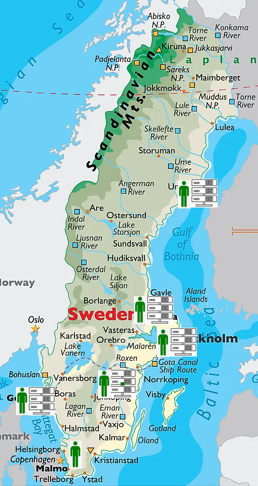
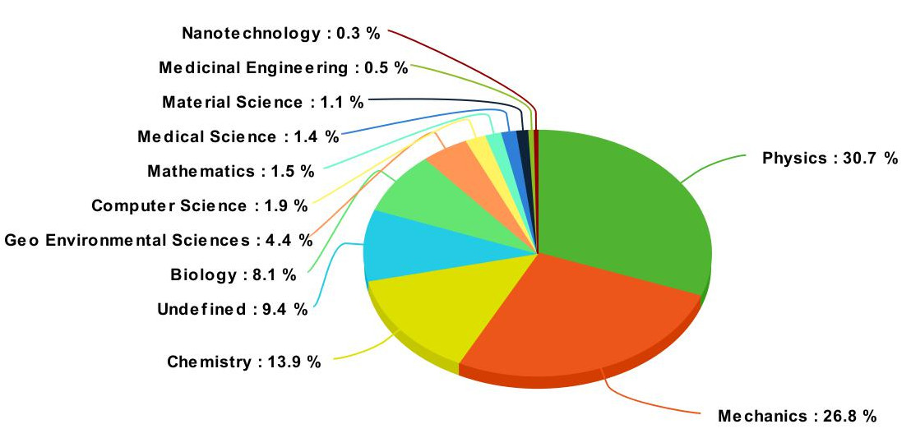

<!-- paginate: true -->

#
#
#
#
# Introduction to PDC

## XX
## 2024-01-22

---

# Overview

1. [General information about PDC](#3)
1. [How to apply to PDC resources](#11)
1. [Infrastructure at PDC](#15)
1. [How to login](#18)
1. [File systems, permissions and transfer](#25)
1. [Modules](#27)
1. [How to run jobs](#30)
1. [How to compile](#39)
1. [How to contact PDC support](#42)

---

# General information about PDC

---

# NAISS

<div class="row">
<div class="column50">

The National Academic Infrastructure for Supercomputing in Sweden (NAISS) is a infrastructure organization for high-performance computing in Sweden. NAISS is hosted by Linköping University but acts independently with a national perspective and responsibility. NAISS main funding is provided by the Swedish Research council (VR) while the user support is built up in partnership with several Swedish universities.

</div>
<div class="column50">




</div></div>

---

<!-- _hide: true -->

# Research areas at PDC



*Usage of beskow, march 2017*

---

# PDC offers...

<div class="columnlightblue">

* HPC facilities
* Access to international HPC facilities
* Data storage facilities
* Research collaboration with academia and industry
* Expertise in HPC software enhancement
* Support for using PDC services
* Training

</div></div>

---

# Courses

<div class="row">
<div class="column50">


</div>
<div class="column50 columnlightblue">

* Summer school/Introduction to HPC development
* Introduction to PDC
* Programming languages
* Advanced development
* Software specific courses

</div></div>

---

# Groups at PDC

<div class="row">
<div class="columnlightblue column33">

### System administrators

* Hardware management
* Accounts
* Security
* Job scheduling

</div><div class="columnlightblue column33">

### Scientific services

* Basic -> Advanced software support
* User driven software development

</div><div class="columnlightblue column33">

### Software services

* Software development of flagship codes
* Optimization

</div>
</div>

---

# User driven software development

* Software development targeting user needs
  * Parallelisation of existing software in collaboration with researchers
  * Optimization of existing software in collaboration with researchers
* Scientific area specific user support
* Installation of scientific softwares

<div class="columnlightblue">

* PDC expert development support is free for swedish academia
* The support is time limited
* Funded by KTH and NAISS
* Acknowledgement and/or co-authorship for PDC and supporting expert

</div>

---

# Software services - Flagship codes at PDC

### VeloxChem - quantum chemistry
  - A modern code for quantum chemistry
  - Applications for research and for teaching

### Neko - computational fluid dynamics
  - Simulations of the incompressible Navier-Stokes equations
  - State-of-the art performance and scaling

### GROMACS - molecular dynamics
  - A leading code for molecular dynamics
  - Engineered for extreme performance on multiple hardware architectures

---

# How to apply for PDC resources

---

# Can I use PDC resources?

* PDC resources are **free** for swedish academia
* Please acknowledge NAISS/PDC in your publications
  *"The computations/data handling/[SIMILAR] were/was enabled by resources provided by the National Academic Infrastructure for Supercomputing in Sweden (NAISS) at [NAISS AFFILIATED SITE] partially funded by the Swedish Research Council through grant agreement no. 2022-06725"*

<div class="information">

https://www.naiss.se/policies/acknowledge/
</div>

---

# How to access PDC resources

### Time allocations

* A measure for how many jobs you can run per month (corehours/month)
* Which clusters you can access
  * Every user must belong to at least one time allocation
* Apply via a SUPR account at https://supr.naiss.se/

<div class="information">

https://www.naiss.se/#section_allocations
</div>

### User account (SUPR/PDC)

* For projects you must have a linked SUPR and PDC account https://supr.naiss.se/
* For courses a PDC account suffices

---

# Flavors of time allocations

<div class="columnlightblue">

**Small allocation** *<10000 corehours/month*
Applicant can be a PhD student or higher
Evaluated on a technical level only weekly
   
</div>
<div class="columnblue">

**Medium allocation** *10000-400000 corehours/month*
Applicant must be a senior scientist in swedish academia
Evaluated on a technical level only monthly
	
</div>
<div class="columndarkblue">

**Large allocation** *>400000 corehours/month*
Applicant must be a senior scientist in swedish academia
Evaluated on a technical and scientific level twice a year

</div>

---

# Infrastructure at PDC

---

# What is a cluster

<div class="row">
<div class="column50">


</div>
<div class="column50">

# Cluster
#
# Nodes
#
# CPUs
# Cores

</div>

---

# Dardel

<div class="row">
<div class="column50">


**Nodes:** 1270
**Cores:** 158976
**Peak performance:** 13.5 PFLOPS

</div>
<div class="column50 columnlightblue">

### Node configuration

* 2xAMD EPYC™ 2.25 GHz CPU with 64 cores each
* RAM
  * 256 GB
  * 512 GB RAM
  * 1024 GB RAM
  * 2048 GB RAM
* 4xAMD Instinct™ MI250X GPUs

</div></div>

---

# How to login

---

# Login with SSH pairs

* Only available if your PDC account is linked to a SUPR account

<div class="attention">
You must be a member of an allocation in SUPR
</div>
<div class="information">

https://www.pdc.kth.se/support/documents/login/ssh_login.html
</div>

---

# Kerberos

* authentication protocol originally developed at MIT
* PDC uses kerberos together with SSH for login

### Ticket
* Proof of users identity
* Users use password to obtain tickets
* Tickets are cached on users computer for a specified duration
* As long as tickets are valid there is no need to enter password

<div class="attention">
Tickets should always be created on your local computer
</div>

---

# Kerberos login from any OS

* You can reach PDC from any computer or network
* The kerberos implementation heimdal can be installed on most operating systems
  * **Linux:** heimdal, openssh-client
  * **Windows:** Windows Subsystem for Linux (WSL), Network Identity Manager, PuTTY
  * **Mac:** homebrew/openssh
  * **KTH Computers:** pdc-[kerberos command]

<div class="information">

https://www.pdc.kth.se/support/documents/login/login.html
</div>

---

# Login using kerberos ticket

1. Get a 7 days forwardable ticket on your local system
   ```
   $ kinit -f -l 7d [username]@NADA.KTH.SE
   ```
1. Forward your ticket via ssh and login
   ```
   $ ssh [username]@dardel.pdc.kth.se
   ```

---

# Kerberos commands

| Command | Description |
| --- | --- |
| kinit | proves your identity |
| klist | List of your kerberos tickets |
| kdestroy | destroy your kerberos ticket file |
| kpasswd | change your kerberos password |

```
$ kinit -f [username]@NADA.KTH.SE
$ klist -T
Principal: [username]@NADA.KTH.SE
Issued Expires Flags Principal
Mar 25 09:45 Mar 25 19:45 FI krbtgt/NADA.KTH.SE@NADA.KTH.SE
```

---

# Thinlinc

<div class="row">
<div class="column50">


</div>
<div class="column50 columnlightblue">

* Remote desktop environment 
* Graphical user interface for many softwares
* Interactive job launcher

<div class="information">

https://www.pdc.kth.se/support/documents/login/interactive_hpc.html
</div>

</div>
</div>

---

# File systems at PDC

<div class="row">
<div class="column50 columnlightblue">

## Lustre file system

1. Distributed
1. High performance
1. No backup

</div>
<div class="column50">

### $HOME
**Quota:** 25 GB
```
/cfs/klemming/home/[u]/[username]
```
### Scratch
Data deleted after 30 days
```
/cfs/klemming/scratch/[u]/[username]
```

### Projects
**Quota:** according to project
```
/cfs/klemming/projects/supr/
```

</div></div>

---

# File transfer

Files can be transfered to PDC clusters using **scp**

### From my laptop to $HOME at dardel
```
scp file.txt [username]@dardel.pdc.kth.se:~
```

### From my laptop to scratch on dardel
```
scp file.txt [username]@dardel.pdc.kth.se:/cfs/klemming/scratch/[u]/[username]
```

<div class="information">

https://www.pdc.kth.se/support/documents/data_management/data_management.html
</div>

---

# Modules

## Used to load a specific software, and versions, into your environment

```
$ module show R/4.0.0
-------------------------------------------------------------------
/pdc/modules/system/base/R/4.0.0:

module-whatis	 GNU R 
module-whatis	   
module		 add gcc/7.2.0 
module		 add jdk/1.8.0_45 
prepend-path	 PATH /pdc/vol/R/4.0.0/bin 
prepend-path	 MANPATH /pdc/vol/R/4.0.0/share/man 
prepend-path	 LD_LIBRARY_PATH /pdc/vol/R/4.0.0/lib64/ 
-------------------------------------------------------------------
```

---

# Module commands

| Command | Abbreviation | Description |
| --- | --- | --- |
| module load *[s]/[v]* | ml *[s]/[v]* | Loads software/version |
| module avail *[s]/[v]* | ml av *[s]/[v]* | List available software |
| module show *[s]/[v]* | ml show *[s]/[v]* | Show info about software |
| module list | ml | List currently loaded software |
| ml spider *[s]* |  | searches for software |

**[s]:** Software. Optional for *avail* command
**[v]:** Version. Optional. Latest by default

---

# Accessing the Cray Programming Environment

```
$ ml av PDC
---- /pdc/software/modules ---------------------
      PDC/21.09    PDC/21.11    PDC/22.06 (L,D)
```

* Every PDC module relate to a specific version of **CPE**
* Every software is installed under a specific **CPE**
* To access the softwares you need to first...
  ```
  $ ml PDC/[VERSION]
  ```
* Omitting the *[version]* you will load the latest stable **CPE**

---

# How to run jobs

---

# SLURM workload manager

<div class="column columnlightblue">
Allocates exclusive and/or non-exclusive access to resources (computer nodes) to users for some duration of time so they can perform work.
</div>
<div class="column columnlightblue">
Provides a framework for starting, executing, and monitoring work (typically a parallel job) on a set of allocated nodes.
</div><div class="column columnlightblue">
Arbitrates contention for resources by managing a queue of pending work
</div><div class="column columnlightblue">
Installed by default, no need to load module
</div>

---

# Which allocation I am a member of

### projinfo

```
$ projinfo -h
Usage: projinfo [-u <username>] [-c <clustername>] [-a] [-o] [-m] [-c <cluster>] [-d] [-p <DNR>] [-h]
-u [user] : print information about specific user
-o : print information about all (old) projects, not just current
-m : print usage of all months of the project
-c [cluster] : only print allocations on specific cluster
-a : Only print membership in projects
-d : Usage by all project members
-p [DNR] : only print information about this project
-h : prints this help
```
Statistics are also available at… 
https://pdc-web.eecs.kth.se/cluster_usage/

---

# Partitions

<div class="row">
<div class="column50 columnlightblue">

**Main**
Exclusive node access
Time limit: 24h

</div>
<div class="column50 columnlightblue">

**Long**
Exclusive node access
Time limit: 7 days

</div>
<div class="column50 columnlightblue">

**GPU**
4xGPUs Exclusive node access
Time limit: 24h

</div>
<div class="column50 columnlightblue">

**Memory**
512+ Gb RAM Exclusive node access
Time limit: 24h

</div></div>
<div class="row">
<div class="column50 columnlightblue">

**Shared**
Shared node access
Time limit: 24h (most nodes), 7 days

</div></div>
<div class="attention">
Partition are a mandatory entry for running jobs on Dardel
</div>


---

# Using salloc

#### To book and execute on a dedicated node
```
$ salloc -t <min> -N <nodes> -A <allocation> -p <partition> srun -n <ntasks> ./MyPrgm
```
#### To run interactively
```
$ salloc -t <min> -N <nodes> -A <allocation> -p <partition>
$ ml [modulename]
$ srun -n <ntasks> <executable>
$ srun -n <ntasks> <executable>
$ exit
```
---

# Working with shared nodes
```
$ salloc -t <min> -N <nodes> -A <allocation> -p shared ...
```

### When using a shared node you must specify the number of cores

| Parameter | Description |
| --- | --- |
| -n [tasks] | Allocates n tasks |
| --cpus-per-task [cores] | Allocates cores=ntasks*cpus-per-task (Default n=1) |


<div class="attention">
RAM will be allocated proportionally to the number of cores</span>
</div>

---

# Other SLURM flags

| Command | Description |
| --- | --- |
| --reservation=[reservation] | Reserved nodes |
| --mem=1000000 | At least 1TB RAM |

<div class="attention">
If the cluster does not have enough nodes of that type then the request will fail with an error message.
</div>

---

# Using sbatch scripts

<div class="row">
<div class="column50 columnlightblue">

#### Create a file

</div><div class="column50">

```
#!/bin/bash -l
# Name of job
#SBATCH -J <myjob>
#SBATCH -A <allocation ID>
# Reservation if needed
#SBATCH --reservation=<reservation ID>
#SBATCH -t <min>
#SBATCH --nodes=<nodes>
#SBATCH -p <partition>
#SBATCH -n <ntasks>
# load modules and run
ml PDC/22.06
srun -n <ntasks> ./MyPrgm
```

</div><div class="row">
</div><div class="column50 columnlightblue">

#### Run

</div><div class="column50 column">

```
$ sbatch <myfile>
```

</div></div>

---

# Other SLURM commands

### Show my running jobs
```
$ squeue [-u <username>]
```

### To remove a submitted job
```
$ scancel [jobID]
```

---

# How to compile on Dardel

## Dardel uses compiler wrappers

* Always use the wrappers

  * **cc** C code
  * **CC** C++ code
  * **ftn** Fortran code
      
* Wrappers automatically link with math libraries if their modules are loaded
  ```
  $ ml cray-fftw
  ```

* Other libraries are lapack, blas scalapack, blacs,...
  https://www.pdc.kth.se/software/#libraries

---

# PrgEnv modules

| Module | Compiler |
| --- | --- |
| PrgEnv-cray | CRAY |
| PrgEnv-gnu | GNU |
| PrgEnv-aocc | AMD |

* By default **PrgEnv-cray** is loaded
* Swap it by using command...
  ```
  $ ml PrgEnv-<other>
  ```
  
---

# Compiling for AMD GPUs

## Load the rocm module
```
$ ml rocm
$ ml craype-accel-amd-gfx90a
```

## Use the hipcc compiler for AMD GPUs
```
$ hipcc --offload-arch=gfx90a MyPrgm.cpp -o MyPrgm
```
<div class="information">

https://www.pdc.kth.se/support/documents/software_development/development_gpu.html
</div>

---

# PDC Support

1. A lot of question can be answered via our web http://www.pdc.kth.se/support
1. The best way to contact us is via our ticketing system https://www.pdc.kth.se/support/documents/contact/contact_support.html
1. The support request will be tracked
1. Use a descriptive subject
1. Provide your PDC user name.
1. Provide all necessary information to reproduce the problem.
1. For follow ups always reply to our emails
