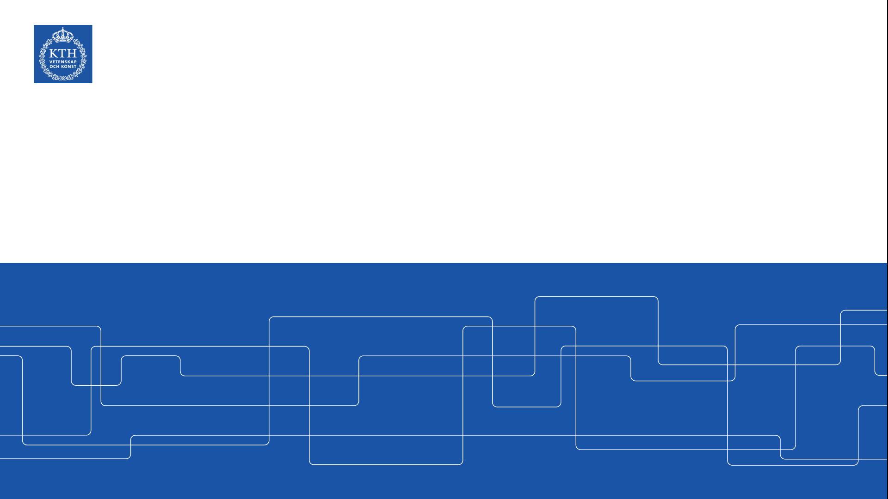
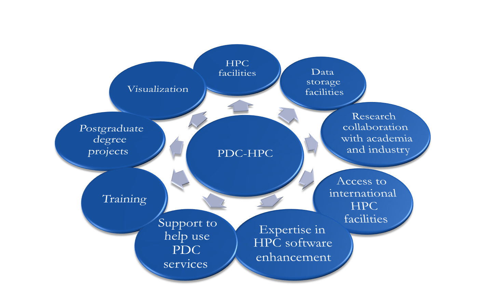
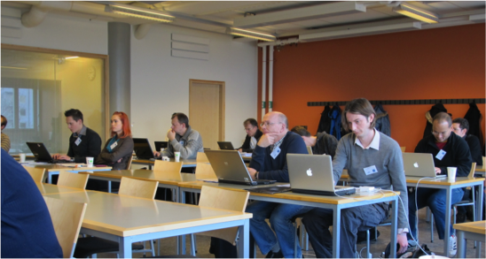
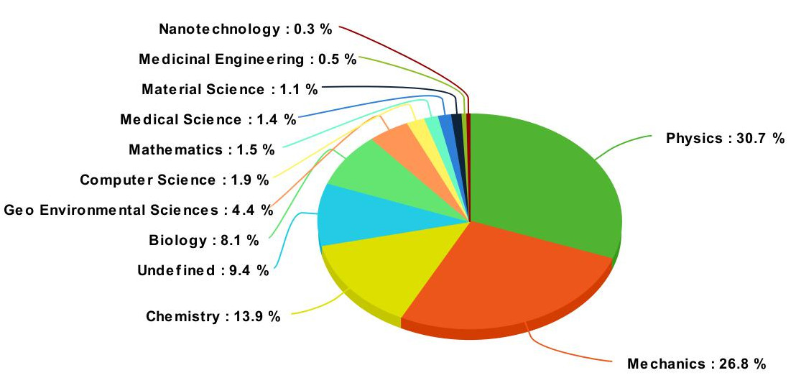

<!-- paginate: true -->

# PDC Center for High Performance Computing

---

# Overview

1. Courses
1. Support
1. Industrial collaborations
1. Supercomputing resources
1. Cloud resources
1. Storage resources
1. Backup
1. How to apply to PDC resources
1. How to login to PDC resources

---

# PDC offers...

---

# Courses

* Summer school/Introduction to HPC development
* Introduction to PDC
* Programming languages
* Advanced development
* Software specific courses

---

# Research areas at PDC

*Usage of beskow, march 2017*

---

# PDC key assets: Support

### First-line support
Helps you have a smooth start to using PDC’s resources and provides assistance if you need help while using our facilities

### Advanced support
Application experts that can support in development of code, how to submit jobs, scaling, projects and allocations

### System administrators
System managers/administrators that ensure that PDC’s HPC and storage facilities run smoothly and securely

---

# Infrastructure at PDC

---

# Dardel

**Nodes:** 794
**Cores:** 101632
**Peak performance:** 13.5 PFLOPS

### Node configuration

* 2xAMD EPYC™ 2.25 GHz 64 cores
* RAM
  * 524 nodes, 256 GB
  * 256 nodes, 512 GB RAM
  * 8 nodes, 1024 GB RAM
  * 6 nodes, 2048 GB RAM
* 4xAMD Instinct™ MI250X GPUs

---

# How to apply for PDC resources

---

# How to get resources from PDC

* You can apply for a SUPR account at https://supr.snic.se
* In SUPR send in a proposal for your project
* More information at http://www.snic.se/allocations/apply4access/

---

# Different levels of projects

**Small allocation** *<5000 corehours/month*
Applicant must at least be a PhD student
Evaluated weekly on a technical level
   

**Medium allocation** *5000-400000 corehours/month*
Applicant must be a senior scientist in swedish academia
Evaluated monthly on a technical level
	

**Large allocation** *400000+ corehours/month*
Applicant must be a senior scientist in swedish academia
Evaluated twice per year on a technical and scientific level

---

# Can I use PDC resources?

* PDC resources are **free** for swedish academia
* Please acknowledge SNIC/PDC in your publications
  *"The computations/data handling/[SIMILAR] were/was enabled by resources provided by the Swedish National Infrastructure for Computing (SNIC), partially funded by the Swedish Research Council through grant agreement no. 2018-05973"*
* More information at http://www.snic.se/allocations/apply4access/

---

# How to login to PDC resources

1. SSH keypairs validated via SUPR
1. Kerberos
1. Thinlinc (Graphical interface)

---

# Questions

1. A lot of question can be answered via our web http://www.pdc.kth.se/
1. The best way to contact us is via https://www.pdc.kth.se/support/documents/contact/contact_support.html

---
