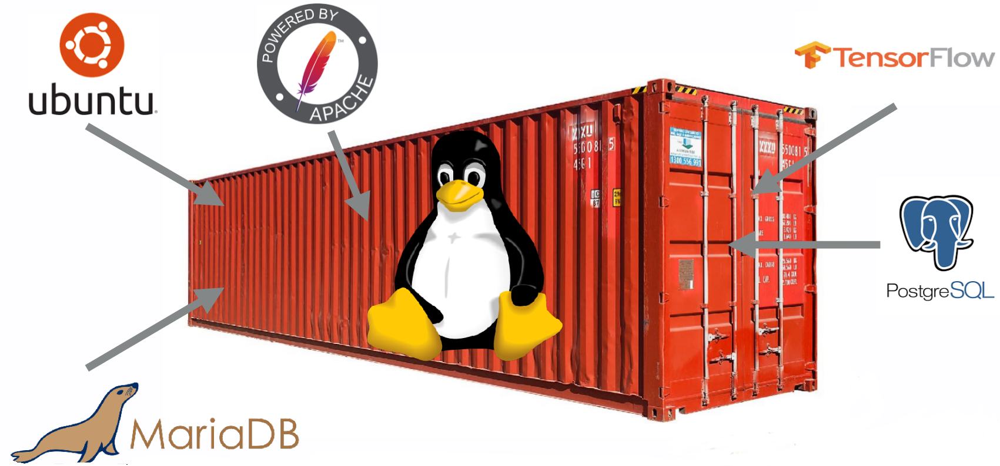
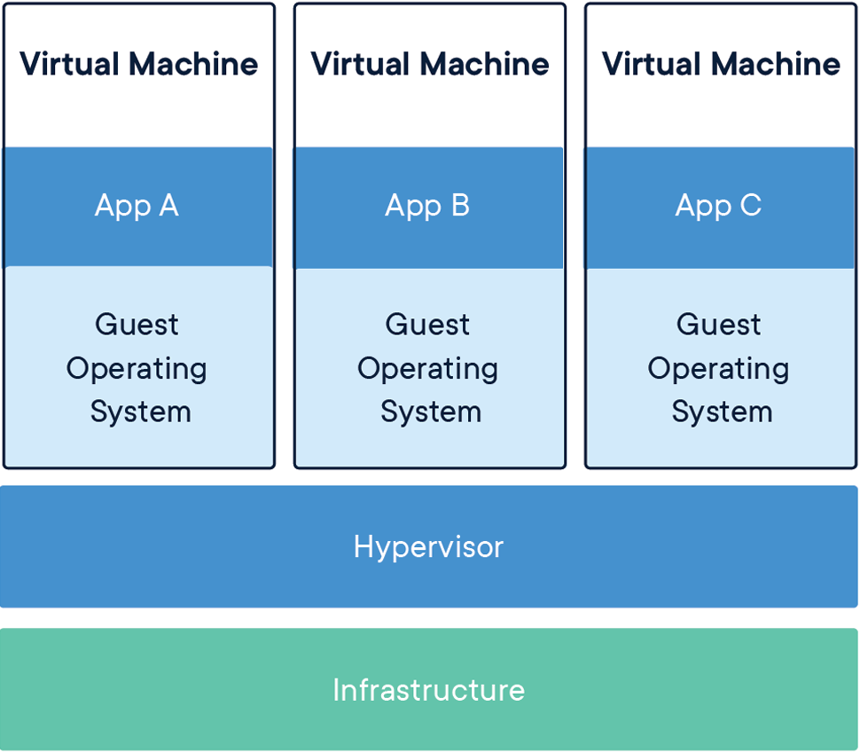
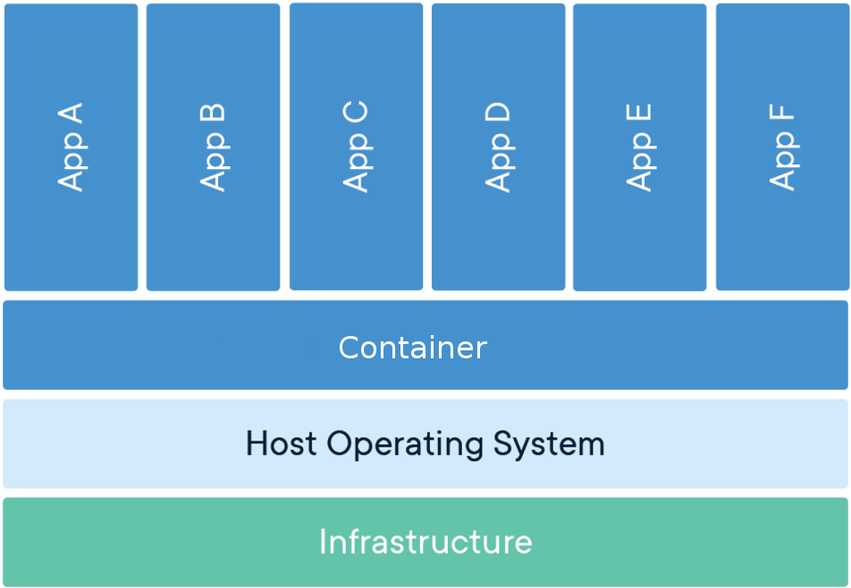
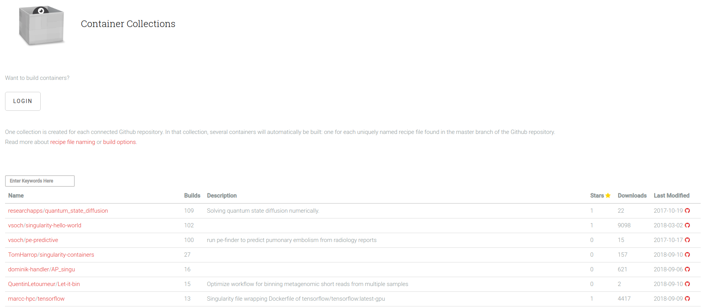

<!-- paginate: true -->

# Introduction to Singularity

# Henric Zazzi
#
#

---

# Overview

- What are containers
- Docker, the most popular container
- Singularity: Containers for the HPC environment
- installation of singularity
- Using the container
- How to build containers
- Running your container in an HPC environment
- Creating recipes for singularity

---

# What are containers



---

A container image is a lightweight, standalone, executable package of software that includes everything needed to run an application.

<div class="row">
<div class="column50">

#### Virtual Machine


</div><div>

#### Container


</div></div>

---

# Containers: How are they useful

- Reproducibility
- Portability
- Depending on application and use-case, simple extreme scalability
- Next logical progession from virtual machines

---

# Why do we want containers in HPC?

- Escape “dependency hell”
- Load fewer modules
- Local and remote code works identically every time
- One file contains everything and can be moved anywhere

---

# Docker, the most popular container


---

# The Docker container software

- The most know and utilized container software
- Facilites workflow for creating, maintaining and distributing software
- Easy to install, well documented, standardized
- Used by many scientist

---

# Docker on HPC: The problem

- Incompabilities with scheduling managers (SLURM...)
- No support for MPI
- No native GPU support
- Docker users can escalate to root access on the cluster
- @color[red](Not allowed on HPC clusters)

---

# Singularity: Containers for the HPC environment

- Package software and dependencies in one file
- Use same container in different SNIC clusters
- Limits user’s	privileges,	better security
- Same user inside container as on host
- No need for most modules
- <span style="color:red;">Negligable performance decrease</span>

---

# But I want to keep using docker

- Works great for local and private resources.
- No HPC centra will install docker for you
- <span style="color:red;">Singularity can import Docker images</span>

---

# Singularity hub

https://singularity-hub.org/



---

# Singularity Versions

- Latest version: 3.0.0 (2018-10-08)
- Installed on Tegner: 2.5.1
- Installed on VM: 2.5.2

---

# Singularity workflow

<div class="row">
<div class="column50 columnlightblue">

### Local computer
*Root access*

1. Create container
1. *singularity build*
1. Install software
1. Install libraries

</div>
<div class="column50 columnlightblue">

### HPC Cluster
*User access*

1. *singularity shell*
1. *singularity exec*
1. *singularity help*
1. *singularity run*

</div></div>

---

# Install singularity in Linux

```
$ VERSION=2.5.2
$ sudo apt-get update
$ sudo apt-get install libarchive-dev
$ sudo apt-get install squashfs-tools
# Get and install
$ wget github.com/sylabs/singularity/releases/
download/$VERSION/singularity-$VERSION.tar.gz
$ tar xvf singularity-$VERSION.tar.gz
$ cd singularity-$VERSION
$ ./configure --prefix=/usr/local
$ make
$ sudo make install
```

For Mac or Windows, follow instructions at https://www.sylabs.io/guides/2.6/user-guide/installation.html

---

# Launching a container

- Singularity sets up the container environment and creates the necessary
  namespaces.
- Directories, files and other resources are shared from the host into the
  container.
- All expected I/O is passed through the container: pipes, program arguments,
  std, X11
- When the application(s) finish their foreground execution process, the
  container and namespaces collapse and vanish cleanly

---

# Using the container

---

# Download and test an image

Download and test the latest UBUNTU image from docker hub

```
$ sudo singularity build my_image.simg docker://ubuntu:latest
Docker image path: index.docker.io/library/ubuntu:latest
Cache folder set to /root/.singularity/docker
Importing: base Singularity environment
Building Singularity image...
Singularity container built: my_image.simg
$ singularity shell my_image.simg
Singularity: Invoking an interactive shell within container...
Singularity my_image.simg:~> cat /etc/*-release

```

<span style="color:red;">Do it yourself</span>

---

# Exercise 1: Download a container

1. Go to singularity hub and find the hello-world container (https://singularity-hub.org/collections)
1. build the container using singularity
  (shub://[full name of container])
1. Use the container shell and get acquainted with it 

---

# How to build containers

---

# Why must I be root?

Same permissions in the container as outside...

To be root in the singularity image you must be root on the computer

---

# Build a writeable image

Since there are memory limitation on writing directly to image file,
it is better to create a sandbox

```
$ sudo singularity build --sandbox my_sandbox my_image.simg
Building from local image: my_image.simg
Singularity container built: my_sandbox
$ sudo singularity shell -w my_sandbox
Singularity: Invoking an interactive shell within container...
Singularity my_sandbox:~>
```

---

# How do I execute commands in singularity

Commands in the container can be given as normal.

```
singularity exec my_image.simg ls
```
```
$ singularity shell my_image.simg
Singularity: Invoking an interactive shell within container...
Singularity my_image.simg:~> ls
```

---

# Transfer files into container

**Read mode:** You can read/write to file system outside container and
read inside container.

**write mode:** You can read/write inside container.

<span style="color:red;">Remember: In write mode you are user ROOT, home folder: /root</span>

---

# How to transfer files into the container

```
$ sudo singularity exec -w my_sandbox mkdir singularity_folder
$ sudo singularity shell -B my_folder:/root/singularity_folder -w my_sandbox
Singularity my_sandbox:~> cp singularity_folder/file1 .
```

<span style="color:red;">Do it yourself:</span>

---

# Exercise 2: Create your own container

1. Go to docker hub and find the official latest ubuntu
1. build the container using singularity
1. Build a writeable sandbox
1. Install necessary tools into the container (Compiler etc...)
   1. apt-get update
   1. apt-get install build-essential

---

# singularity.d folder

Startup scripts etc... for your singularity image

```
$ singularity exec my_image.simg ls -l /.singularity.d
total 1
drwxr-xr-x 2 root root  76 Sep 11 17:05 actions
drwxr-xr-x 2 root root 139 Sep 11 17:23 env
drwxr-xr-x 2 root root   3 Sep 11 17:05 libs
-rwxr-xr-x 1 root root  33 Sep 11 17:23 runscript
-rwxr-xr-x 1 root root  10 Sep 11 17:05 runscript.help
```

<span style="color:red;">Important: The files must be executable and owned by root</span>

---

# Creating a script


### runscript

```
#!/bin/sh

ls -l
```

### command

```
$ singularity run my_image.simg
total 1
drwxr-xr-x 2 root root  76 Sep 11 17:05 file1
drwxr-xr-x 2 root root 139 Sep 11 17:23 file2
```

---

# What is a help file and how is it used

### runscript.help

```
This is a text file
```

### command

```
$ singularity help my_image.simg
This is a text file
```

---

# Build a new container from a sandbox

```
$ sudo singularity build my_new_image.simg my_sandbox
Building image from sandbox: my_sandbox
Building Singularity image...
Singularity container built: my_new_image.simg
Cleaning up...
```

<span style="color:red;">Do it yourself:</span>

---

# Exercise 3: Edit your own container

1. Create a help file
1. Create/Edit the runscript running hello world
1. Create a new container from the sandbox

<span style="color:red;">**Tip:** You can use the editor in your VM and then transfer the file</span>

---

# Running your container in an HPC environment

---

# Requirements

- OpenMPI version must be the same in container and cluster
- Compiler and version must be the same in container and cluster
- You need to bind to the LUSTRE file system at PDC so it can be detected

---

# What are the required tools

wget, build-essential, lzip, m4, libgfortran3, gmp, mpfr, mpc,
zlib, gcc, openmpi, cmake, python, cuda

- On AFS
  - /afs/pdc.kth.se/pdc/vol/singularity/2.5.1/shub.backup
- On Lustre
  - /cfs/klemming/pdc.vol.tegner/singularity/2.4.2/shub
- **Image:** ubuntu-16.04.3-gcc-basic.simg
- https://www.pdc.kth.se/software

---

# Send in a singularity batch job and execute

```
#!/bin/bash -l
#SBATCH -J myjob
#SBATCH -A edu18.prace
#SBATCH --reservation=prace-2018-10-25
#SBATCH -t 1:00
#SBATCH --nodes=1
#SBATCH --ntasks-per-node=8
#SBATCH -o output_file.o
module add gcc/6.2.0 openmpi/3.0-gcc-6.2 singularity
mpirun -n 8 singularity exec -B /cfs/klemming hello_world.simg hello_world_mpi
```

<span style="color:red;">Do it yourself:</span>

---

# Exercise 4: Run a HPC container

1. Login into tegner.pdc.kth.se
1. send in a job for the hello-world image
1. Use the hello_world image on PDCs singularity repository

<span style="color:red;">**Tip:** With the singularity module use the **Path:** $PDC_SHUB</span>

---

# How about GPUs?

**Flag:** --nv

Finds the relevant nVidia/CUDA libraries on your host.
 
```
salloc -t <time> -A edu18.prace --gres=gpu:K420:1
srun -N 1 singularity exec --nv -B /cfs/klemming cuda.simg cuda_device
Device Number: 0
  Device name: Quadro K420
  Memory Clock Rate (KHz): 891000
  Memory Bus Width (bits): 128
  Peak Memory Bandwidth (GB/s): 28.512000
```

---

# Creating recipes for singularity

---

# Singularity Recipes

A Singularity Recipe is the driver of a custom build, and the starting point
for designing any custom container. It includes specifics about installation
software, environment variables, files to add, and container metadata

---

# How to build from a recipe

A recipe is a textfile explaining what should be put into the container

```
sudo singularity build my_image.simg my_recipe
```

---

# Recipe format

```
# Header
Bootstrap: docker
From: ubuntu:latest
# Sections
%help
  Help me. I'm in the container.
%files
    mydata.txt /home
%post
    apt-get -y update
    apt-get install -y build-essential
%runscript
    echo "This is my runscript"
```

---

# Header

What image should we start with?

- *Bootstrap:*
  - shub
  - docker
  - localimage
- *From:*
  - The name of the container
```
# Header
Bootstrap: docker
From: ubuntu:latest
```

---

# Section: %help

Some information about your container.
Valuable to put information about what software and versions
are available in the container

```
%help
  This container is based on UBUNTU 16.04. GCC v6.2 installed
```

---

# Section: %post

What softwares should be installed in my container.

```
%post
    apt-get -y update
    apt-get install -y build-essential
```

<span style="color:red;">No interaction in the scripts</span>
<span style="color:red;">We do not need sudo in the container</span>

---

# Section: %files

What local files should be copied into my container

```
%files
    # <filename> <singularity path>
    myfile.txt /opt
```

---

# Section: %runscript

What should be executed with the run command.

```
%runscript
    mysoftware -param1 -param2
    
```

<span style="color:red;">Do it yourself:</span>

---

# Exercise 5: Create a recipe

1. Based on UBUNTU
1. Install compilers
1. Create a help text
1. Create a runscript
1. Run the recipe

<span style="color:red;">**Tip:** You can use the editor in your VM and then transfer the file</span>

---

# Useful links

- https://www.pdc.kth.se/software/software/singularity/
- https://www.sylabs.io/guides/2.6/user-guide/
- https://gitpitch.com/PDC-support/singularity-introduction#/
