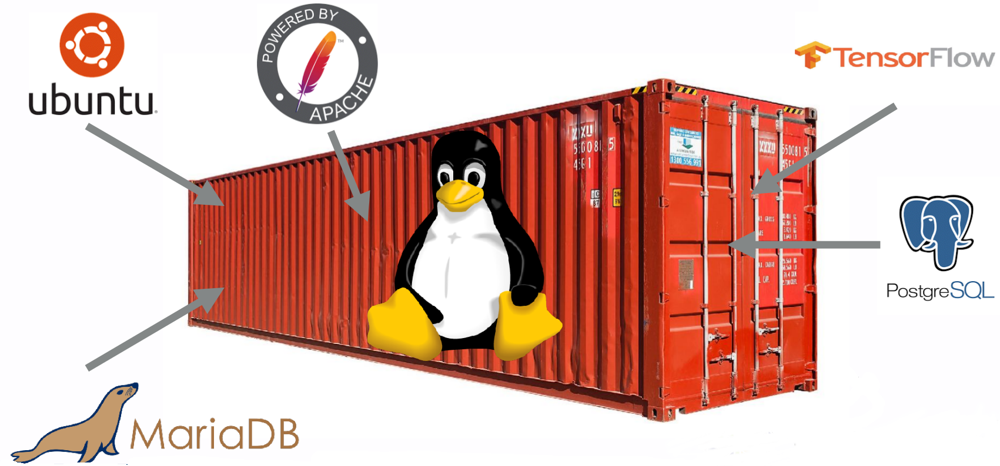
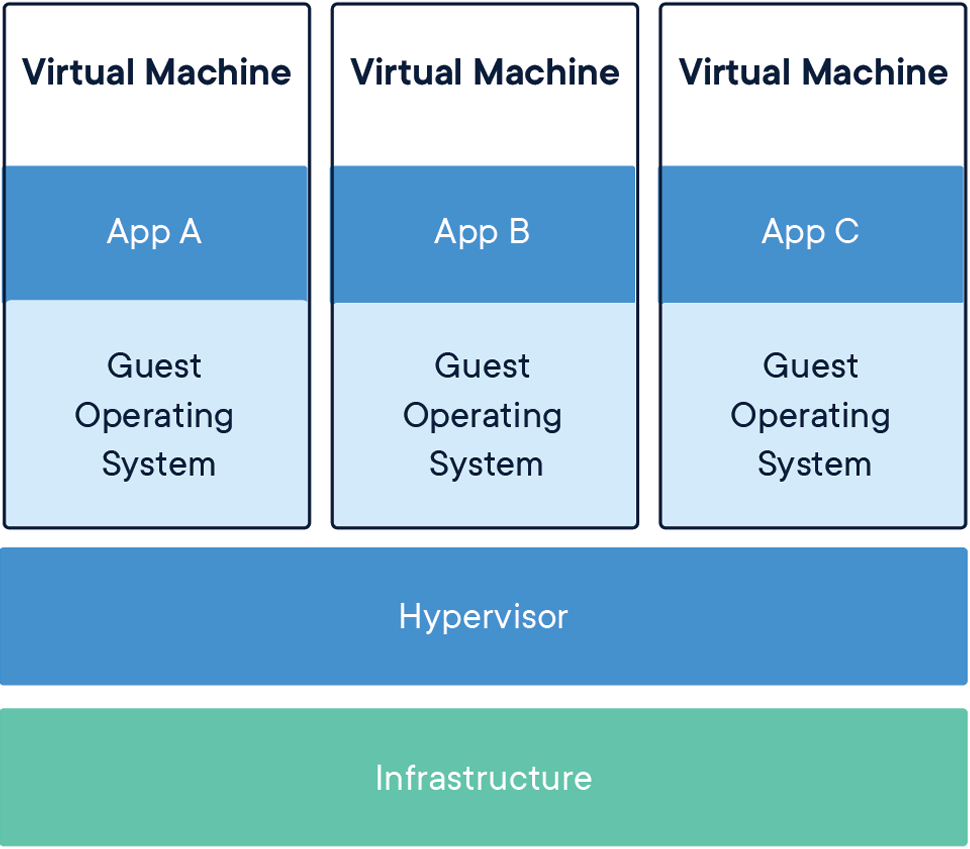
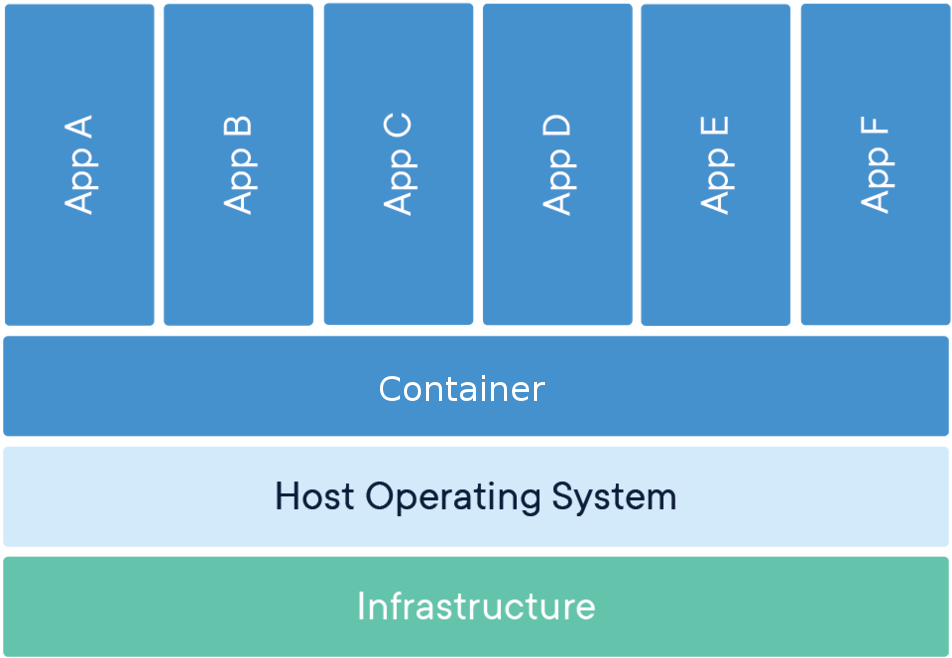
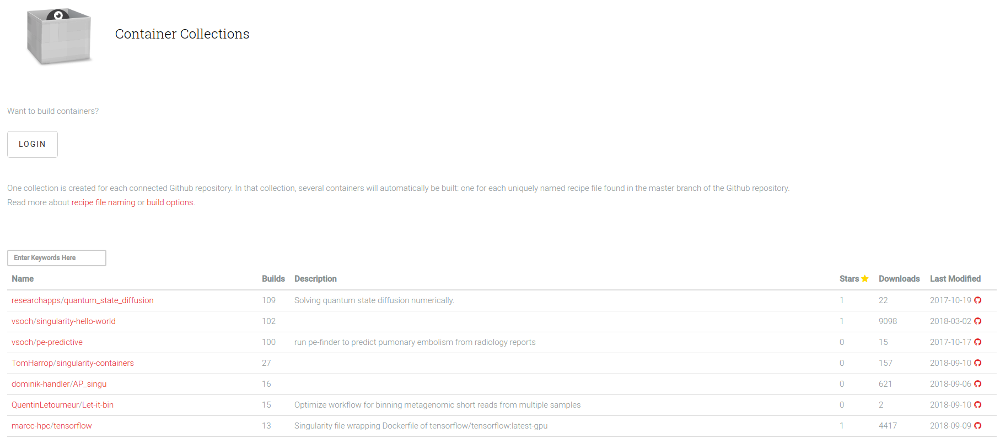

<!-- paginate: true -->

# Introduction to Containers

# Henric Zazzi


---

# Overview

- What are containers
- Docker, the most popular container
- Singularity & AppTainer: Containers for the HPC environment
- installation of singularity & apptainer
- How to build containers
- Installing software in a container
- Running your container in an HPC environment
- Creating recipes for singularity & apptainer

---

# What are containers



---

### A container image is a lightweight, standalone, executable package of software that includes everything needed to run an application.

<div class="row">
<div class="column50">

#### Virtual Machine


</div><div>

#### Container


</div></div>

---

# Containers: How are they useful

- Reproducibility
- Portability
- Depending on application and use-case, simple extreme scalability
- Next logical progession from virtual machines

---

# Why do we want containers in HPC?

- Escape "dependency hell"
- Load fewer modules
- Local and remote code works identically every time
- One file contains everything and can be moved anywhere

---

# Docker, the most popular container


---

# The Docker container software

- The most know and utilized container software
- Facilites workflow for creating, maintaining and distributing software
- Easy to install, well documented, standardized
- Used by many scientist

---

# Docker on HPC: The problem

- Incompabilities with scheduling managers (SLURM...)
- No support for MPI
- No native GPU support
- Docker users can escalate to root access on the cluster
- <span class="warning">Not allowed on HPC clusters</span>

---

# Singularity & AppTainer: Containers for the HPC environment

- Package software and dependencies in one file
- Use same container in different HPC clusters
- Limits user’s	privileges,	better security
- Same user inside container as on host
- No need for most modules
- <span class="tip">Negligable performance decrease</span>

---

# But I want to keep using docker

- Works great for local and private resources.
- No HPC centra will install docker for you
- <span class="tip">We can import Docker images</span>

---

# Singularity hub

https://singularity-hub.org/



---

# Versions

### singularityCE (Community Edition)

- Installed on Dardel: 4.4.2

### AppTainer

- Installed on Dardel: 1.5.1

<span class="tip">Singularity and AppTainer are interchangeable</span>

---

# Workflow

<div class="row">
<div class="column50 columnlightblue">

### Local computer
*Root access*

1. Create container
1. *singularity build* 
1. Install software
1. Install libraries

</div>
<div class="column50 columnlightblue">

### HPC Cluster
*User access*

1. *singularity shell*
1. *singularity exec*
1. *singularity help*
1. *singularity run*

</div></div>

---

# Install singularity or apptainer on your computer

### You need a local installed copy of singularity to write within your container

#### Singularity Community Edition

https://docs.sylabs.io/guides/3.0/user-guide/installation.html

#### Apptainer

https://apptainer.org/docs/admin/main/installation.html

---

# Launching a container

- Sets up the container environment and creates the necessary
  namespaces.
- Directories, files and other resources are shared from the host into the
  container.
- All expected I/O is passed through the container: pipes, program arguments,
  std, X11
- When the application(s) finish their foreground execution process, the
  container and namespaces collapse and vanish cleanly

---

# How to build containers

---

# Download and test an image

Download and test the latest UBUNTU image from docker hub

```
$ singularity build my_image.sif docker://ubuntu:latest
INFO:    Starting build...
Getting image source signatures
...
INFO:    Creating SIF file...
INFO:    Build complete: my_image.sif
$ singularity shell my_image.sif
Singularity> cat /etc/*-release
DISTRIB_ID=Ubuntu
DISTRIB_RELEASE=22.04
DISTRIB_CODENAME=jammy
Singularity> exit
```

---

# Paths for building containers

```
singularity build [image].sif [name]
```

| From | Path | Access |
| --- | --- | --- |
| Singularity hub | shub://[name] | Default |
| Docker hub | docker://[name] | Default |
| Local | [name] | Default |
| Sandbox | [Sandox folder name] | Default |
| Recipe | [recipe name] | Root |

---

# How do I execute commands

Commands in the container can be given as normal.

```
$ singularity exec my_image.sif ls
```
```
$ singularity shell my_image.sif
Singularity> ls
```

---

# Installing software in container

---

# Write within a container

1. In order to write in a container you must be root
1. Same permissions in the container as outside...
1. To be root in a container you must be root on the computer

---

# Read and write modes

**Read mode:** You can read/write to file system outside container and read inside container.

**write mode:** You can read/write inside container.

<span class="warning">**Remember:** In write mode you are user ROOT, home folder: /root</span>

---

# Use a writeable image

When opening a container for write you can install software in the container.

```
$ sudo singularity shell -w my_sandbox
Singularity> apt-get update
```
<span class="tip">**Tip:** No root is needed for *update* as we are already root</span>

---

# Binding folders

```
... -B [local folder]:[singularity folder] ...
```

* Enables transferring of data to container
* Enables accessing external data from within the container
* Enables running external scripts from within the container
* For using PDC filesystem you must bind to *cfs/klemming*

---

# How to use binding to run local scripts

1. Create local folder and internal singularity folder as **root**
   ```
   $ mkdir my_folder
   $ sudo singularity exec -w my_sandbox mkdir /usr/local/sing
   ```
1. Starting container and bind folders
   The file *myscript*, residing in my_folder, will be executed as within the container but we are also obscuring container folder */opt*
   ```
   $ singularity exec -B my_folder:/opt my_sandbox /opt/myscript
   ```

---

# Example on how to transfer files into the container

1. Create local folder
   ```
   $ mkdir my_folder
   ```
1. Starting container as *root* and bind folders
   ```
   $ sudo singularity shell -B my_folder:/opt -w my_sandbox
   ```
1. Copy *file1* to container folder
   ```   
   Singularity> cp /opt/file1 .
   ```

---

# Initiating your container

---

# singularity.d folder

Startup scripts etc... for your singularity image

```
$ singularity exec my_image.sif ls -l /.singularity.d
-rw-r--r-- 1 root root   39 Feb 17 09:27 Singularity
drwxr-xr-x 2 root root 4096 Feb 17 09:27 actions
drwxr-xr-x 2 root root 4096 Feb 17 09:27 env
-rw-r--r-- 1 root root  459 Feb 17 09:27 labels.json
drwxr-xr-x 2 root root 4096 Feb 17 09:27 libs
-rwxr-xr-x 1 root root 1933 Feb 17 09:27 runscript
-rwxr-xr-x 1 root root 10   Feb 17 09:27 runscript.help
-rwxr-xr-x 1 root root   10 Feb 17 09:27 startscript
```

<span class="warning">**Important:** The files must be executable and owned by root</span>

---

# Creating a script


### Example of runscript file

```
#!/bin/sh
echo "Hello world!"
```

### Executing the runscript file

```
$ singularity run my_image.sif
Hello world!
```

---

# What is a help file and how is it used

### Example of runscript.help file

```
This is a text file
```

### Print the information within

```
$ singularity run-help my_image.sif
This is a text file
```

---

# Creating recipes

---

# Singularity Recipes

- A recipe is the driver of a custom build, and the starting point for designing any custom container.
- It includes specifics about installation software, environment variables, files to add, and container metadata

---

# How to build from a recipe

A recipe is a textfile explaining what should be put into the container

```
sudo singularity build [container].sif [recipe].def
```

Recipes for images that can be used on PDC clusters can be found at https://github.com/PDC-support/PDC-SoftwareStack/tree/master/other/singularity

---

# Printing how a container was built

```
singularity inspect --deffile [container]
```

---

# How to build from a recipe on Dardel

#### This command will remotely build a sandboxed container remotely
```
ml PDC singularity
build_container [recipe].def
```

<span class="tip">**Tip:** You can also build containers for ARM nodes using **--arm**</span>

See more parameters with...
```
build_container --help
```

---

# How to build from a recipe on Dardel via sylabs

#### Create sylabs token
1. Login into sylabs https://cloud.sylabs.io/builder
1. Press USERNAME -> Access tokens
1. Enter a name for your token and press Create Access Token
1. Copy or download the token.

```
ml PDC singularity
singularity remote login
```

When you run this command on the cluster, it will save your access token

```
singularity build --remote --sandbox <sandbox name> <recipe name>
```

---

# Recipe format

```
# Header
Bootstrap: docker
From: ubuntu:latest
# Sections
%help
  Help me. I'm in the container.
%files
    mydata.txt /home
%post
    apt-get -y update
    apt-get install -y build-essential
%runscript
    echo "This is my runscript"
```

---

# Header

What image should we start with?

- *Bootstrap:*
  - shub
  - docker
  - localimage <span class="warning">Not possible for remote builds</span>
- *From:*
  - The name of the container
```
# Header
Bootstrap: docker
From: ubuntu:latest
```

---

# Section: %help

Some information about your container.
Valuable to put information about what software and versions
are available in the container

```
%help
  This container is based on UBUNTU 22.04. GCC installed
```

---

# Section: %post

What softwares should be installed in my container.

```
%post
    apt-get -y update
    apt-get install -y build-essential
```

1. You cannot interact during execution of the scripts
1. We do not need *sudo* in the container

---

# Section: %files

What local files should be copied into my container

```
%files
    <local filename> <singularity path>
```

<span class="warning">Not possible for remote builds</span>

---

# Section: %runscript

What should be executed with the run command.

```
%runscript
    <software executable> -<parameter1>
```

---

# Running your container in an HPC environment

---

# Requirements

1. OpenMPI version must be the same in container and cluster
1. You need to bind to the klemming LUSTRE file system so it can be detected
1. You can use *build* but only from other images and only sandboxes
1. You can **ONLY** run *sandbox* and not *SIF* files
   1. A singularity file is copied to all processes whereas a *sandbox* folder structure is not
---

# Transfer a SIF file

```
scp <SIF file> <username>@dardel.pdc.kth.se:/cfs/klemming/home/<u>/<username>
singularity build --sandbox <sandbox name> <SIF file>
```

---

# What are the required tools

- **Packages:** wget git bash gcc gfortran g++ make
- **Source:** MPICH

```
ml PDC
ml singularity
```

In folder *$PDC_SHUB* you can find already built images at PDC

---

# Executes a container on 2 nodes

```
#!/bin/bash -l
# The -l above is required to get the full environment with modules
# Set the allocation to be charged for this job
#SBATCH -A 202X-X-XX
# The name of the script is myjob
#SBATCH -J myjob
# Only 1 hour wall-clock time will be given to this job
#SBATCH -t 1:00:00
# Number of nodes
#SBATCH --nodes=2
# Using the shared partition as we are not using all cores
#SBATCH -p shared
# Number of MPI processes per node
#SBATCH --ntasks-per-node=12
# Run the executable named myexe
ml PDC singularity
srun -n 24 --mpi=pmi2 singularity exec <sandbox folder> <myexe>
```

---

# Executes GPU enabled code with containers

```
#!/bin/bash -l
# The -l above is required to get the full environment with modules
# Set the allocation to be charged for this job
#SBATCH -A 201X-X-XX
# The name of the script is myjob
#SBATCH -J myjob
# Only 1 hour wall-clock time will be given to this job
#SBATCH -t 1:00:00
# Number of nodes
#SBATCH --nodes=1
# Using the GPU partition
#SBATCH -p gpu
# Run the executable named myexe
ml PDC singularity
srun -n 1 singularity exec --rocm -B /cfs/klemming <sandbox folder> <myexe>
```

<span class="tip">**Tip:** Using flag **--nv** enables you to run the container on NVIDIA GPU</span>

---

# Useful links

* https://www.pdc.kth.se/support/documents/software/singularity.html
* https://github.com/PDC-support/PDC-SoftwareStack/tree/master/other/singularity
* https://sylabs.io/docs/
* https://apptainer.org/

---

# Exercizes

Exercise 2 and 3 crave root access and need an installation of AppTainer or Singularity on your laptop

---

# Exercise 1: Download a container

1. Go to singularity hub and find the hello-world container (https://singularityhub.github.io/singularityhub-archive/)
1. build the container using singularity
1. Use the container shell and get acquainted with it 

---

# Exercise 2: Create your own container as root

1. Go to docker hub and find the official latest ubuntu
1. build the container using singularity
1. Build a writeable sandbox
1. Install necessary tools into the container (Compiler etc...)
   1. apt-get update
   1. apt-get install build-essential

---

# Exercise 3: Edit your own container as root

1. Create a help file
1. Create/Edit the runscript printing *Hello world!*

<span class="tip">**Tip:** You can use an editor in your VM or create it and then transfer the file</span>

---

# Exercise 4: Create a recipe

1. Based on UBUNTU
1. Install compilers
1. Create a help text
1. Create a runscript
1. Run the recipe

---

# Exercise 5: Run a HPC container

1. Login into dardel.pdc.kth.se
1. send in a job for the hello-world sandbox
1. Use the hello_world in PDCs singularity repository

<span class="tip">**Tip:** With the singularity module use the path *$PDC_SHUB*</span>

---
