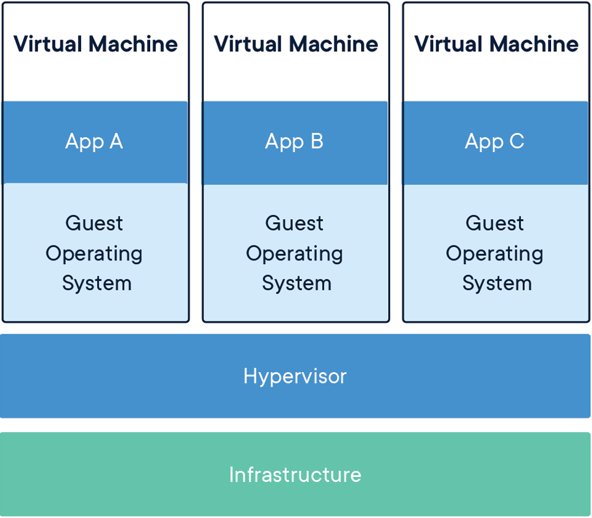

<!-- paginate: true -->

# Introduction to containers

## Henric Zazzi
## 2025-10-06


---

# Overview

- What are containers
- Docker, the most popular container
- Containers for the HPC environment
- installation of singularity/AppTainer
- How to build containers
- Installing software in container
- Running your container in an HPC environment
- Creating recipes for singularity or AppTainer

Singularity and AppTainer will be presented but commands are interchangeable
---

# What are containers


---

A container image is a lightweight, standalone, executable package of software that includes everything needed to run an application.

<div class="row">
<div class="column50">

#### Virtual Machine


</div><div>

#### Container


</div></div>

---

# Containers: How are they useful

- Next logical progession from virtual machines
- Reproducibility
  - Local and remote code works identically every time
- Portability
  - One file contains everything and can be moved anywhere
  - Load fewer modules
- Escape “dependency hell”

---

# Docker, the most popular container


---

# The Docker container software

- The most know and utilized container software
- Facilites workflow for creating, maintaining and distributing software
- Easy to install, well documented, standardized
- Used by many scientist

---

# Docker on HPC: The problem

- Incompabilities with scheduling managers (SLURM...)
- No support for MPI
- No native GPU support
- Docker users can escalate to root access on the cluster
- <span style="color:red;">Not allowed on HPC clusters</span>

---

# Containers for the HPC environment

# **SingularityCE** and **AppTainer**

- Package software and dependencies in one file
- Use same container in different SNIC clusters
- Limits user’s	privileges,	better security
- Same user inside container as on host
- No need for most modules
- <span style="color:red;">Negligable performance decrease</span>

---

# But I want to keep using docker

- Works great for local and private resources.
- No HPC centra will install docker for you
- <span style="color:red;">Singularity can import Docker images</span>

---

# Singularity hub

https://singularity-hub.org/


---

# Singularity Versions

### singularityCE (Community Edition)

- Installed on Dardel: 4.2.0

### AppTainer

- Installed on Dardel: 1.4.0

---

# Singularity workflow

<div class="row">
<div class="column50 columnlightblue">

### Local computer
*Root access*

1. Create container
1. *singularity build* 
1. Install software
1. Install libraries

</div>
<div class="column50 columnlightblue">

### HPC Cluster
*User access*

1. *singularity build* (Only from other builts)
1. *singularity shell*
1. *singularity exec*
1. *singularity help*
1. *singularity run*

</div></div>

---

# Install singularity/apptainer on your computer

### You need a local installed copy of singularity to create your container

## Install singularityCE
https://docs.sylabs.io/guides/3.0/user-guide/installation.html

## Install AppTainer
https://apptainer.org/docs/admin/main/installation.html

---

# Launching a container

- Singularity/AppTainer sets up the container environment and creates the necessary
  namespaces.
- Directories, files and other resources are shared from the host into the
  container.
- All expected I/O is passed through the container: pipes, program arguments,
  std, X11
- When the application(s) finish their foreground execution process, the
  container and namespaces collapse and vanish cleanly

---

# How to build containers

---

# Download and test an image

Download and test the latest UBUNTU image from docker hub

```
$ sudo singularity build my_image.sif docker://ubuntu:latest
INFO:    Starting build...
Getting image source signatures
...
INFO:    Creating SIF file...
INFO:    Build complete: my_image.sif
$ singularity shell my_image.sif
Singularity> cat /etc/*-release
DISTRIB_ID=Ubuntu
DISTRIB_RELEASE=22.04
DISTRIB_CODENAME=jammy
Singularity> exit
```

---

# Paths for building containers

```
singularity build [image].sif [name]
```

| From | Path |
| --- | --- |
| Singularity hub | shub://[name] |
| Docker hub | docker://[name] |
| Local | [name] |
| Sandbox | [Sandox folder name] |
| Recipe | [recipe name] |

---

# How do I execute commands in singularity

Commands in the container can be given as normal.

```
$ singularity exec my_image.sif ls
```
```
$ singularity shell my_image.sif
Singularity> ls
```

---

# Installing software in container

---

# Why must I be root?

Same permissions in the container as outside...

To be root in the singularity image you must be root on the computer

---

# Build a writeable image

Since there are memory limitation on writing directly to image file,
and a new image file is created for each MPI process,
it is better to create a sandbox that does not have this limitation.

```
$ sudo singularity build --sandbox my_sandbox my_image.sif
INFO:    Starting build...
INFO:    Verifying bootstrap image my_image.sif
...
INFO:    Creating sandbox directory...
INFO:    Build complete: my_sandbox
$ singularity shell my_sandbox
Singularity>
```

---

# Use a writeable image

When opening a container for write you can install software in the container.

```
$ sudo singularity shell -w my_sandbox
Singularity> apt-get update
```
<span style="color:red;">**Tip:** No root is needed for *update* as we are already root</span>

---

# Transfer files into container

**Read mode:** You can read/write to file system outside container and
read inside container.

**write mode:** You can read/write inside container.

<span style="color:red;">Remember: In write mode you are user ROOT, home folder: /root</span>

---

# Binding folders

```
... -B [local folder]:[singularity folder] ...
```

* Enables transferring of data to container
* Enables accessing external data from within the container
* Enables running external scripts from within the container
* For using PDC filesystem you must bind to *cfs/klemming*

---

# How to use binding to run local scripts

1. Create local folder and internal singularity folder 
   ```
   $ mkdir my_folder
   $ sudo singularity exec -w my_sandbox mkdir /usr/local/sing
   ```
1. Starting container and bind folders
   The file *myscript*, residing in my_folder, will be executed as within the container
   ```
   $ singularity exec -B my_folder:/usr/local/sing -w my_sandbox /usr/local/sing/myscript
   ```
1. Obscuring container folder */opt*
   ```
   $ singularity exec -B my_folder:/opt my_sandbox /opt/myscript
   ```

---

# Example on how to transfer files into the container

1. Create local folder and internal singularity folder 
   ```
   $ mkdir my_folder
   $ sudo singularity exec -w my_sandbox mkdir singularity_folder
   ```
1. Starting container as *root* and bind folders
   ```
   $ sudo singularity shell -B my_folder:/root/singularity_folder -w my_sandbox
   ```
1. Copy *file1* to container folder
   ```   
   Singularity> cp singularity_folder/file1 .
   ```

---

# Initiating your container

---

# singularity.d folder

Startup scripts etc... for your singularity image

```
$ singularity exec my_image.sif ls -l /.singularity.d
-rw-r--r-- 1 root root   39 Feb 17 09:27 Singularity
drwxr-xr-x 2 root root 4096 Feb 17 09:27 actions
drwxr-xr-x 2 root root 4096 Feb 17 09:27 env
-rw-r--r-- 1 root root  459 Feb 17 09:27 labels.json
drwxr-xr-x 2 root root 4096 Feb 17 09:27 libs
-rwxr-xr-x 1 root root 1933 Feb 17 09:27 runscript
-rwxr-xr-x 1 root root 10   Feb 17 09:27 runscript.help
-rwxr-xr-x 1 root root   10 Feb 17 09:27 startscript
```

<span style="color:red;">Important: The files must be executable and owned by root</span>

---

# Creating a script


### Example of runscript file

```
#!/bin/sh
echo "Hello world!"
```

### Executing the runscript file

```
$ singularity run my_image.sif
Hello world!
```

---

# What is a help file and how is it used

### Example of runscript.help file

```
This is a text file
```

### Print the information within

```
$ singularity run-help my_image.sif
This is a text file
```

---

# Creating recipes for singularity or AppTainer

---

# Singularity Recipes

A Singularity Recipe is the driver of a custom build, and the starting point
for designing any custom container. It includes specifics about installation
software, environment variables, files to add, and container metadata

---

# How to build a container locally from a recipe

A recipe is a textfile explaining what should be put into the container

```
sudo singularity build [container].sif [recipe].def
```

Recipes for images that can be used on PDC clusters can be found at https://github.com/PDC-support/PDC-SoftwareStack/tree/master/other/singularity

---

# How to build a container remotely from a recipe

Dardel has a remote building pipeline that is accessible **ONLY** for
dardel users.

#### How to buld a remote container
```
ml PDC singularity/apptainer
build_container [recipe].def
```

#### For more information...
```
build_container --help
```

---

# Printing how a container was built

```
singularity inspect --deffile [container]
```

---

# Recipe format

```
# Header
Bootstrap: docker
From: ubuntu:latest
# Sections
%help
  Help me. I'm in the container.
%files
    mydata.txt /home
%post
    apt-get -y update
    apt-get install -y build-essential
%runscript
    echo "This is my runscript"
```

---

# Header

What image should we start with?

- *Bootstrap:*
  - shub
  - docker
  - localimage
- *From:*
  - The name of the container
```
# Header
Bootstrap: docker
From: ubuntu:latest
```

---

# Section: %help

Some information about your container.
Valuable to put information about what software and versions
are available in the container

```
%help
  This container is based on UBUNTU 22.04. GCC installed
```

---

# Section: %post

What softwares should be installed in my container.

```
%post
    apt-get -y update
    apt-get install -y build-essential
```

<span style="color:red;">No interaction in the scripts</span>
<span style="color:red;">We do not need sudo in the container</span>

---

# Section: %files

What local files should be copied into my container

```
%files
    <local filename> <singularity path>
```

---

# Section: %runscript

What should be executed with the run command.

```
%runscript
    <software executable> -<parameter1>
    
```

---

# Running your container in an HPC environment

---

# Requirements

- OpenMPI version must be the same in container and cluster
- Compiler must be the same in container and cluster
- You need to bind to the LUSTRE file system at PDC so it can be detected
- You can use *build* but only from other images or sandboxes
- You can **ONLY** run *sandbox* and not *SIF* files
  - A singularity file is copied to all nodes whereas a *sandbox* folder structure is not

---

# Transfer a SIF file

```
scp <SIF file> <username>@dardel.pdc.kth.se:/cfs/klemming/home/<u>/<username>
singularity build --sandbox <sandbox name> <SIF file>
```

---

# What are the required tools

- **Packages:** wget git bash gcc gfortran g++ make
- **Source:** MPICH

```
ml PDC
ml singularity or apptainer
```

* In folder *$PDC_SHUB* you can find already built images at PDC

---

# Executes singularity on 2 nodes

```
#!/bin/bash -l
# The -l above is required to get the full environment with modules
# Set the allocation to be charged for this job
#SBATCH -A 202X-X-XX
# The name of the script is myjob
#SBATCH -J myjob
# Only 1 hour wall-clock time will be given to this job
#SBATCH -t 1:00:00
# Number of nodes
#SBATCH --nodes=2
# Using the shared partition as we are not using all cores
#SBATCH -p shared
# Number of MPI processes per node
#SBATCH --ntasks-per-node=12
# Run the executable named myexe
ml PDC singularity
srun -n 24 --mpi=pmi2 singularity exec <sandbox folder> <myexe>
```

---

# Executes AMD GPU enabled code with singularity

```
#!/bin/bash -l
# The -l above is required to get the full environment with modules
# Set the allocation to be charged for this job
# not required if you have set a default allocation
#SBATCH -A 201X-X-XX
# The name of the script is myjob
#SBATCH -J myjob
# Only 1 hour wall-clock time will be given to this job
#SBATCH -t 1:00:00
# Number of nodes
#SBATCH --nodes=1
# Using the GPU partition which is at the moment is under testing
#SBATCH -p gpu
# Run the executable named myexe
ml PDC singularity
srun -n 1 singularity exec --rocm -B /cfs/klemming <sandbox folder> <myexe>
```

---

# Useful links

* https://www.pdc.kth.se/support/documents/software/singularity.html
* https://github.com/PDC-support/PDC-SoftwareStack/tree/master/other/singularity

